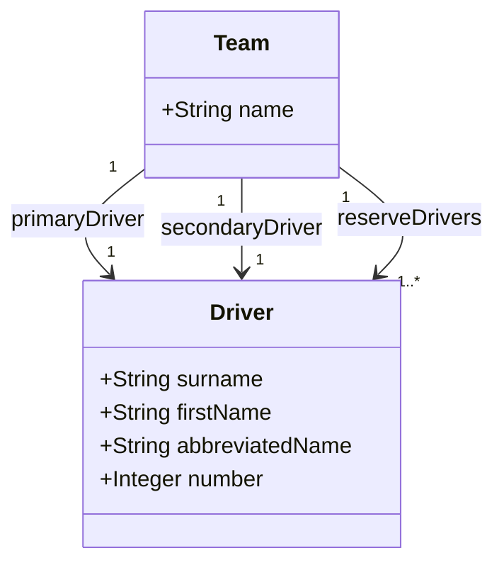

# F1Geek

## Introduction

Source for the F1Geek android app.

## Student Information

Hello

| Field          | Value       |
|----------------|-------------|
| Name           | Adam Cahill |
| Student Number | 20097733    |

## Initial Data Model

