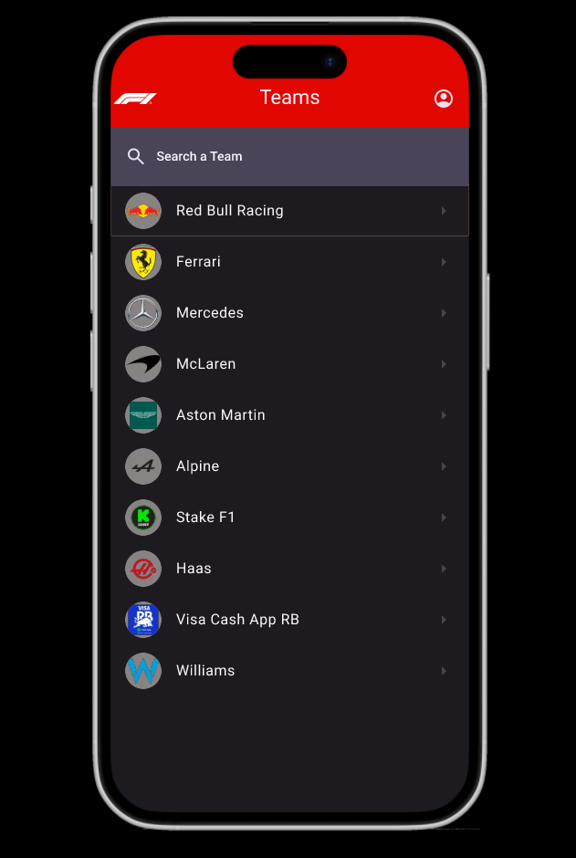

# F1 Geek Design - Version 1

## Student Information

| Field          | Value       |
|----------------|-------------|
| Name           | Adam Cahill |
| Student Number | 20097733    |

## Mindmap - 10%

## User Stories - 10%

* As a Formula 1 fan, I want to see a list of drivers so that I can see who is competing in the championship.
* As a Formula 1 fan, I want to see a list of teams so that I can see who is competing in the championship.
* As a Formula 1 fan, I want to drill down into a driver so that I can see more information about them.
* As a Formula 1 fan, I want to drill down into a team so that I can see more information about them, including their drivers.

* As a Formula 1 fan, I want to see a list of circuits so that I can explore the tracks where the races are held.
* As a Formula 1 fan, I want to drill down into a circuit so that I can see more information about it, including its length, location, and previous race results.
* As a Formula 1 fan, I want to view past race results for a selected circuit by year so that I can see the top performers in each season.
* As a Formula 1 fan, I want to search for drivers, teams, or circuits so that I can quickly find the information I'm looking for.
* As a Formula 1 fan, I want a clean and visually appealing header with the F1 logo and app name so that the app feels professional and matches the Formula 1 branding.

## Design - 20%

## Data Model - 20%

## User Interface - 40%

### Home Page

### Drivers List

### Driver Details

### Team List 

### Team Details 

### Circuit List

### Circuit Details

### Circuit Results
